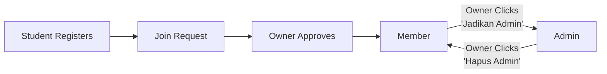

# Invite System Cleanup - February 2026

## Summary
Removed deprecated `album_invites` table system. Admin/member management now works through **role promotion** of existing members, not through invite links or email input.

## What Changed

### ❌ Old System (DEPRECATED)
- **Method**: Generate invite token → Send link → User clicks → Join album
- **Table**: `album_invites` (token, expires_at, role)
- **Routes**: 
  - POST `/api/albums/[id]/invite` (create token)
  - POST `/api/albums/invite/[token]/join` (accept invite)
- **UI**: Generate invite link button

### ✅ New System (CURRENT)
- **Method**: Member joins → Owner promotes to admin
- **Flow**:
  1. User registers via student invite link
  2. Owner approves registration → User becomes member
  3. Owner can promote member to admin via "Jadikan Admin" button
  4. Or demote admin to member via "Hapus Admin" button
- **Table**: `album_members` (role updated via PATCH)
- **Route**: PATCH `/api/albums/[id]/members` (role update only)
- **UI**: List all members with promote/demote buttons in Team sidebar

## Two Separate Systems

| Feature | Admin/Member Management | Student Registration |
|---------|------------------------|---------------------|
| **Status** | ✅ Active (Role Promotion) | ✅ Active (Token) |
| **Storage** | `album_members.role` | `albums.student_invite_token` |
| **UI Location** | Team Sidebar → List + Buttons | Access Sidebar → Generate Link |
| **Target** | Promote existing members | New yearbook students |
| **Flow** | Member → Promote → Admin | Token → Register → Approve → Member |

## Current Admin/Member Flow



## Files Modified

### Removed/Cleaned
1. **YearbookClassesViewUI.tsx**
   - ❌ Removed `generateMemberInvite()` function
   - ❌ Removed `memberInviteLink` state
   - ❌ Removed `creatingMemberInvite` state
   - ❌ Removed `handleAddByEmail()` function (dead code)
   - ❌ Removed `addEmail` & `addingByEmail` states (unused)

2. **/app/invite/[token]/page.tsx**
   - Simplified to only handle student invites (auto-redirect)
   - Removed admin/member invite acceptance UI

3. **/api/albums/invite/[token]/route.ts**
   - Removed album_invites lookup
   - Only checks student invite tokens

### Added
1. **21_add_student_invite_token.sql**
   - Adds `student_invite_token` and `student_invite_expires_at` to albums table
   
2. **22_cleanup_deprecated_album_invites.sql** (OPTIONAL)
   - Drops `album_invites` table if needed for cleanup

3. **/api/albums/[id]/invite-token/route.ts**
   - New endpoint for student invite token generation
   - GET: Retrieve current token
   - POST: Generate new token (default 7 days expiry)

## Migration Steps

### Required
```sql
-- Run this first
\i supabase/migrations/21_add_student_invite_token.sql
```

### Optional Cleanup
```sql
-- Only run if you want to remove old invite system completely
\i supabase/migrations/22_cleanup_deprecated_album_invites.sql
```

## API Endpoints Status

### 🔴 Deprecated (Can be deleted)
- POST `/api/albums/[id]/invite` (create admin/member invite token)
- POST `/api/albums/invite/[token]/join` (join via invite token)
- POST `/api/albums/[id]/members` with email (add by email - unused in UI)

### 🟢 Active
- PATCH `/api/albums/[id]/members` (update member role - promote/demote)
- GET/POST `/api/albums/[id]/invite-token` (student invites)
- GET `/api/albums/invite/[token]` (validate student invite)

## Testing Checklist

- [ ] Can view all members in Team sidebar
- [ ] Can promote member to admin via "Jadikan Admin" button
- [ ] Can demote admin to member via "Hapus Admin" button
- [ ] Can remove member from album
- [ ] Can generate student invite link in Access sidebar
- [ ] Student invite link expires after 7 days
- [ ] Can regenerate student invite link
- [ ] Expired student invite shows error message
- [ ] `/invite/[token]` redirects to registration for students

## Breaking Changes

⚠️ Any existing `album_invites` tokens will stop working after cleanup migration
⚠️ Direct email-based admin invitation removed from UI (use role promotion instead)

## Support

For questions about the new system:
1. **Making Someone Admin**: Wait for them to register → Approve → Click "Jadikan Admin" in Team sidebar
2. **Student Registration**: Generate link in Access sidebar, share with students
3. **Managing Team**: View all members in Team sidebar, promote/demote/remove as needed
